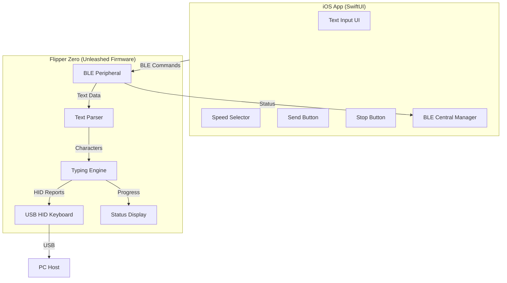

# Dictation - Flipper Zero HID Keyboard over BLE

## Project Overview

A system allowing a Flipper Zero (running Unleashed Firmware) to act as a HID keyboard when connected to a PC via USB-C, while being remotely controlled via BLE from an iPhone companion app.

## System Architecture



## BLE Protocol Specification

### Service UUID
`0x8FE5B3D5-2E7F-4A98-2A48-7ACC60FE0000`

### Characteristics

| UUID | Name | Properties | Purpose |
|------|------|------------|---------|
| `0x19ED82AE-ED21-4C9D-4145-228E62FE0000` | TX Characteristic | Write, Write Without Response, Read | App → Flipper commands/text |
| `0x19ED82AE-ED21-4C9D-4145-228E61FE0000` | RX Characteristic | Indicate, Read | Flipper → App confirmations |
| `0x19ED82AE-ED21-4C9D-4145-228E63FE0000` | Status Characteristic | Notify, Read | Typing progress/status |
| `0x19ED82AE-ED21-4C9D-4145-228E64FE0000` | Config Characteristic | Notify, Read, Write | Speed settings/control |

### Command Protocol (App → Flipper)

| Command | Payload | Description |
|---------|---------|-------------|
| `0x01` | `[0x01][speed:1][text:N]` | Start typing text at speed |
| `0x02` | `[0x02]` | Immediate stop and clear buffer |
| `0x03` | `[0x03][speed:1]` | Update typing speed only |
| `0x04` | `[0x04]` | Get current status |

### Status Protocol (Flipper → App)

| Status Code | Description |
|-------------|-------------|
| `0x00` | Idle |
| `0x01` | Typing in progress |
| `0x02` | Typing completed |
| `0x03` | Stopped/Interrupted |
| `0xFF` | Error |

### Speed Presets

| Preset | Value | Delay per Character |
|--------|-------|---------------------|
| Slow | `0x01` | 150ms |
| Normal | `0x02` | 75ms |
| Fast | `0x03` | 30ms |
| Turbo | `0x04` | 10ms |

## Project Structure

```
/Flipper0Dictate
├── firmware/                          # Flipper Zero Unleashed Firmware
│   └── dictation/
│       ├── dictation.c                # Main application entry
│       ├── dictation.h                # Header file
│       ├── ble_handler.c              # BLE communication
│       ├── ble_handler.h
│       ├── hid_keyboard.c             # USB HID keyboard emulation
│       ├── hid_keyboard.h
│       ├── typing_engine.c            # Character typing logic
│       ├── typing_engine.h
│       ├── text_parser.c              # Text to keycode conversion
│       ├── text_parser.h
│       └── scenes/
│           ├── dictation_scene.c      # Main menu scene
│           ├── dictation_scene.h
│           └── dictation_scene_i.c    # Scene implementation
│
└── ios/                               # iOS Companion App
    └── DictationApp/
        ├── App/
        │   └── DictationApp.swift     # App entry point
        ├── Views/
        │   ├── ContentView.swift      # Main view
        │   ├── TextInputView.swift     # Text input component
        │   ├── SpeedSelectorView.swift # Speed picker
        │   └── ConnectionStatusView.swift
        ├── ViewModels/
        │   └── DictationViewModel.swift
        ├── Services/
        │   ├── BLEManager.swift       # CoreBluetooth central
        │   └── BLEConstants.swift     # UUID constants
        ├── Models/
        │   ├── TypingStatus.swift
        │   └── SpeedPreset.swift
        └── Resources/
            └── Assets.xcassets
```

## Key Implementation Details

### Flipper Zero (C/Ftobuf)

1. **USB HID Keyboard Emulation**: Uses Unleashed firmware's USB HID API to send keyboard reports
2. **BLE Peripheral**: Implements GAP/GATT server for iPhone connection
3. **Text Parser**: Converts ASCII text to USB HID keycodes (supports a-z, A-Z, 0-9, spaces, newlines, common symbols)
4. **Typing Engine**: Processes character queue with configurable delays, checks for stop commands between characters
5. **Ring Buffer**: Stores incoming text for processing

### iOS App (SwiftUI)

1. **CBCentralManager**: Scans for and connects to Flipper Zero peripheral
2. **Text Editor**: Multi-line TextEditor for pasting/typing content
3. **Speed Picker**: Picker with 4 preset options
4. **Send/Stop Controls**: Buttons to control typing
5. **Status Display**: Real-time typing progress via BLE notifications

## File Deliverables

### Firmware Files (8 files)
1. `firmware/dictation/dictation.c` - Main app
2. `firmware/dictation/dictation.h` - Header
3. `firmware/dictation/ble_handler.c` - BLE handling
4. `firmware/dictation/ble_handler.h` - Header
5. `firmware/dictation/hid_keyboard.c` - HID emulation
6. `firmware/dictation/hid_keyboard.h` - Header
7. `firmware/dictation/typing_engine.c` - Typing logic
8. `firmware/dictation/typing_engine.h` - Header

### iOS Files (10 files)
1. `ios/DictationApp/DictationApp.swift` - Entry point
2. `ios/DictationApp/Views/ContentView.swift` - Main view
3. `ios/DictationApp/Views/TextInputView.swift` - Text input
4. `ios/DictationApp/Views/SpeedSelectorView.swift` - Speed picker
5. `ios/DictationApp/Views/ConnectionStatusView.swift` - Status
6. `ios/DictationApp/ViewModels/DictationViewModel.swift` - ViewModel
7. `ios/DictationApp/Services/BLEManager.swift` - BLE central
8. `ios/DictationApp/Services/BLEConstants.swift` - UUIDs
9. `ios/DictationApp/Models/TypingStatus.swift` - Status model
10. `ios/DictationApp/Models/SpeedPreset.swift` - Speed model